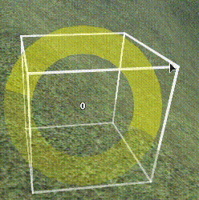
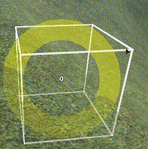

# Nudge Cell
**Nudge Cell** is a plugin for Roblox Studio that is used for quickly adjusting
the occupancy of terrain cells.

Activating the tool will display a box in front of the camera. This box wraps
around the current terrain cell, and displays its current occupancy value. When
the user clicks the yellow adjustment handle, a slider appears, which is used to
finely adjust the occupancy.



Holding `Ctrl` while adjusting will snap to a smaller increment.



See the [demo](assets/demo) directory for more demonstrations.

## Installation
Nudge Cell is available for installation on the Roblox website.

## Building
This plugin can be built manually with **[rbxmk][rbxmk] v0.6.2**.

```bash
rbxmk run build.rbxmk.lua
```

This builds the plugin as the default `NudgeCell.rbxm`, which can be moved to
user's configured plugin folder.

The plugin may instead be built directly to the plugins folder by including it
as a root directory:

```bash
rbxmk run build.rbxmk.lua \
--include-root $PLUGINS_FOLDER \
$PLUGINS_FOLDER/NudgeCell.rbxm
```

Compatible file extensions are `rbxm`, which writes as the binary model format,
and `rbxmx`, which writes as the XML model format.

For asset development, the user's configured asset directory may be included as
a second argument:

```bash
rbxmk run build.rbxmk.lua \
--include-root $PLUGINS_FOLDER \
--include-root $ASSETS_FOLDER \
$PLUGINS_FOLDER/NudgeCell.rbxm \
$ASSETS_FOLDER
```

This will copy assets to the asset folder, and compile the plugin to point to
these assets intead of uploaded versions.

[rbxmk]: https://github.com/Anaminus/rbxmk

## License
The source code and assets for Nudge Cell are licensed under [MIT](LICENSE).
